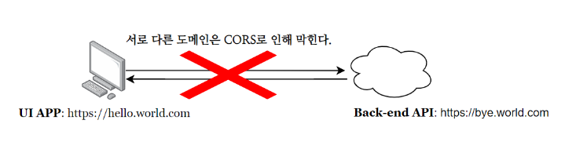
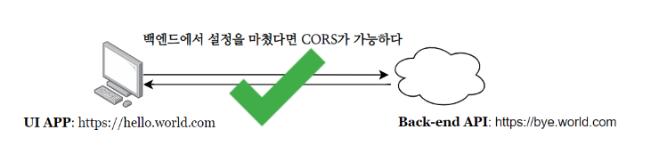

# CSRF & CORS 정리

## 1. CSRF (Cross-Site Request Forgery)

### 개념

*  CSRF는 사용자가 의도하지 않은 요청을 서버에 보내게 만드는 공격이다.
*  브라우저는 동일 사이트의 쿠키를 자동으로 포함하기 때문에 공격이 가능하다.

즉,
 **로그인된 사용자의 권한을 이용한 요청 위조 공격**

---

### 동작 과정

1. 사용자가 서비스(A)에 로그인 → 쿠키 저장
2. 같은 브라우저에서 악성 사이트(B) 접속
3. B에서 A로 요청을 보냄
4. 브라우저가 자동으로 쿠키 포함
5. 서버는 정상 요청으로 오인

*  서버는 “요청이 어디서 발생했는지” 기본적으로 알 수 없다.

---

### 예시

```text
사용자 → 네이버 로그인 (쿠키 저장)
↓
악성 사이트 접속
↓
숨겨진 요청 실행
↓
네이버 서버로 요청 전송 (쿠키 포함)
↓
계정 정보 변경 발생
```

---

### 해결 방법

CSRF 공격을 해결하기 위해서, 해당 HTTP 요청이 사용자 인터페이스를 통해 이루어 졌는지 확인해야한다
CSRF 토큰은 CSRF공격을 방지하는데 사용되는 임의의 토큰이다.
토큰은 사용자 세션마다 고유해야 하며, 쉽게 추측할 수 없도록 긴 임의의 값이어야 한다.

#### 1. CSRF 토큰 방식

*  가장 대표적인 방어 방법
* [서버가 랜덤 토큰을 생성하여 클라이언트와 공유

동작:

1. 서버 → CSRF 토큰 발급
2. 클라이언트 → 요청 시 토큰 포함
3. 서버 → 토큰 검증

 토큰이 없거나 다르면 요청 거부

---

#### 2. Spring Security 설정 예시

```java
@Configuration
@EnableWebSecurity
public class SecurityConfig {

    @Bean
    public SecurityFilterChain filterChain(HttpSecurity http) throws Exception {
        http
            .csrf(csrf -> csrf
                .csrfTokenRepository(CookieCsrfTokenRepository.withHttpOnlyFalse())
            );

        return http.build();
    }
}
```

*  Spring Security는 기본적으로 CSRF 보호 활성화 상태

---

## 2. CORS (Cross-Origin Resource Sharing)

### 개념

*  CORS는 보안 정책이 아니라 **브라우저의 정책**
*  서로 다른 Origin 간 요청을 제한하기 위한 규칙

 **“다른 도메인 간 요청을 허용할지 결정하는 메커니즘”**



---

### Origin이란?

* [ Origin = Protocol + Host + Port

예시:

```text
http://localhost:3000 ≠ http://localhost:8080
```

---

### 동작 원리

1. 브라우저가 다른 Origin 요청 시도
2. 서버에 사전 요청(Preflight, OPTIONS) 전송
3. 서버가 허용 여부 응답
4. 허용 시 실제 요청 진행

* 서버가 허용하지 않으면 브라우저가 차단



---

### 핵심 헤더

```text
Access-Control-Allow-Origin
Access-Control-Allow-Methods
Access-Control-Allow-Headers
```

* 서버에서 명시적으로 허용해야 함

---

### Spring Boot CORS 설정

#### 1. 전역 설정

```java
@Configuration
public class WebConfig implements WebMvcConfigurer {

    @Override
    public void addCorsMappings(CorsRegistry registry) {
        registry.addMapping("/**")
                .allowedOrigins("http://localhost:3000")
                .allowedMethods("GET", "POST", "PUT", "DELETE")
                .allowCredentials(true);
    }
}
```

---

#### 2. Security에서 설정

```java
@Bean
public SecurityFilterChain filterChain(HttpSecurity http) throws Exception {
    http
        .cors(cors -> {})
        .csrf(csrf -> csrf.disable());

    return http.build();
}
```

*  인증 방식(JWT vs 세션)에 따라 CSRF 비활성화 가능

---

## 3. CSRF vs CORS 차이

| 구분    | CSRF      | CORS            |
| ----- | --------- | --------------- |
| 성격    | 공격 기법     | 브라우저 정책         |
| 목적    | 사용자 권한 악용 | 다른 Origin 요청 제한 |
| 발생 위치 | 서버 입장     | 브라우저 입장         |
| 해결 방법 | 토큰 검증     | 서버 헤더 설정        |

* [확실] 둘은 완전히 다른 개념이다.

---

## 4. 핵심 정리

* [확실] CSRF → “사용자를 속여서 요청 보내게 하는 공격”
* [확실] CORS → “브라우저가 다른 도메인 요청을 제한하는 정책”
* [확실] 둘은 목적과 동작 방식이 완전히 다르다.

---

## 5. 면접 핵심 질문

1. CSRF 공격이 가능한 이유는?
2. JWT 사용 시 CSRF는 필요한가?
3. CORS는 서버 보안인가?
4. Preflight 요청이란?


출처
-  https://dev-coco.tistory.com/61  
   → CSRF / CORS 개념 정리
