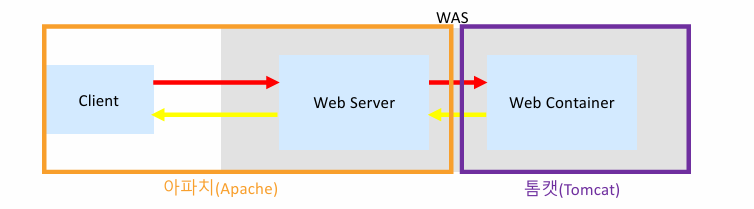
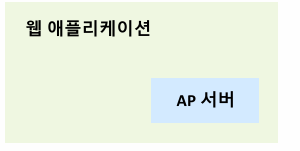
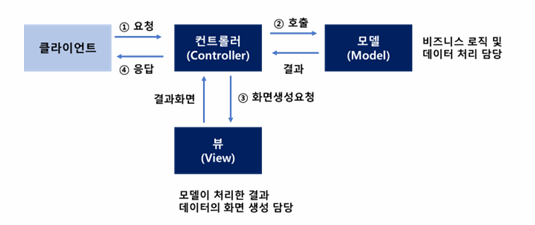
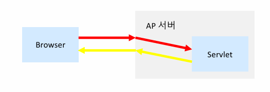
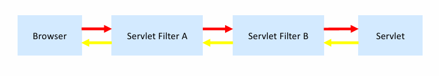
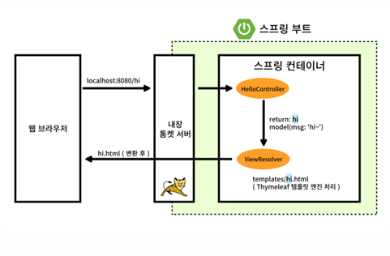

# Spring Boot 프로젝트 시작

## Spring Boot 프로젝트 생성

https://start.spring.io

Spring Boot 기반으로 Spring 프로젝트를 생성해주는 사이트  
Spring에서 운영하며, 원하는 라이브러리를 선택하여 프로젝트를 생성할 수 있다.

---

## Apache Tomcat

Apache Software Foundation에서 개발한 Servlet/JSP를 실행할 수 있는 WAS

Spring에서 Apache Tomcat은 Java 웹 애플리케이션(스프링 MVC)을 실행하는 핵심 WAS이다.

- Apache (Web Server)
    - 정적 리소스 처리 (HTML, CSS, JS)

- Tomcat (WAS)
    - 동적인 요청 처리 (Servlet 실행)

※ 포트는 환경에 따라 변경 가능 (80, 8080은 대표적인 예시)



---

## JSP (Java Server Pages)

HTML 코드에 Java 코드를 넣어 동적 웹 페이지를 생성하는 기술

- Servlet을 직접 작성하지 않고도 웹 프로그래밍 가능
- JSP는 내부적으로 Servlet으로 변환되어 실행됨
- Java 코드를 통해 데이터를 처리하고 HTML 형태로 브라우저에 응답

---

## WAS (Web Application Server)

자바 웹 애플리케이션을 실행하기 위한 서버

- 예: Tomcat, Jetty, Undertow

---

## 내장 WAS (Embedded WAS)

Spring Boot의 핵심 특징

- 애플리케이션 내부에 WAS 포함
- 별도의 서버 설치 필요 없음
- Tomcat 설치 및 설정 없이 실행 가능 



```bash
java -jar app.jar
```

```java
@SpringBootApplication
public class Application {
    public static void main(String[] args) {
        SpringApplication.run(Application.class, args);
    }
}
```

---

## application.properties 파일

Spring Boot 애플리케이션 설정 파일

- 애플리케이션의 다양한 설정을 외부에서 관리
- 환경별 설정 가능 (application-dev.properties)

- 위치
    - src/main/resources

- 형식

```properties
server.port=8080
spring.datasource.url=jdbc:mysql://localhost:3306/test
```

※ key=value 형태의 텍스트 기반 설정 파일

---

## application.yml 파일

application.properties와 동일한 역할

- YAML 문법 사용
- 계층 구조 표현 가능

```yaml
server:
  port: 8080

spring:
  datasource:
    url: jdbc:mysql://localhost:3306/test
```

---

## 프로젝트 구조

- main
    - 실제 애플리케이션 코드

- test
    - 테스트 코드

- build.gradle
    - 의존성 및 빌드 설정

- settings.gradle
    - 프로젝트 설정

---

## Spring MVC

Spring에서 제공하는 웹 애플리케이션 프레임워크

### 구성 요소

- Model
    - 비즈니스 로직
    - 데이터 처리
    - DB 접근 (Service, Repository)

- View
    - 사용자에게 보여지는 화면 (HTML)

- Controller
    - 클라이언트 요청 처리
    - Model 호출 후 결과를 View에 전달



---

## DispatcherServlet

Spring MVC의 핵심 컴포넌트 (Front Controller)

- 모든 HTTP 요청을 받아 처리
- 적절한 Controller에 요청을 전달하고 결과를 반환

---

## Servlet

요청을 수신하고 응답을 반환하는 자바 표준 기술

- 주로 HTTP 프로토콜 사용
- WAS에 등록되며 요청이 오면 메서드 실행



```java
@WebServlet("/hello")
public class HelloServlet extends HttpServlet {

    protected void doGet(HttpServletRequest req, HttpServletResponse resp) {
        System.out.println("요청 처리");
    }
}
```

---

## Servlet Filter

Servlet 처리 전/후에 공통 로직을 수행하는 기술

- 인증, 로깅 등에 사용
- 여러 개 연결 가능



```java
public class LoggingFilter implements Filter {

    public void doFilter(ServletRequest request, ServletResponse response, FilterChain chain) {
        System.out.println("요청 전 처리");
        chain.doFilter(request, response);
        System.out.println("요청 후 처리");
    }
}
```

---



## Spring Boot 동작 환경

1. 클라이언트가 localhost:8080[특정 경로]에 요청 발생
2. 내장 Tomcat이 요청 수신
3. DispatcherServlet에게 전달
4. 스프링 컨테이너 안에서 요청 URL에 맞는 Controller 탐색
5. Controller 실행
6. Controller에서 비즈니스 로직 처리 후 결과 반환
7. ViewResolver가 View를 찾아 처리
8. 클라이언트에게 응답 반환

1 ~ 3: 웹 브라우저 → 내장 Tomcat까지의 요청 흐름

4 ~ 7: Spring MVC 내부 처리 과정 (DispatcherServlet 중심)

8: 최종 응답 반환