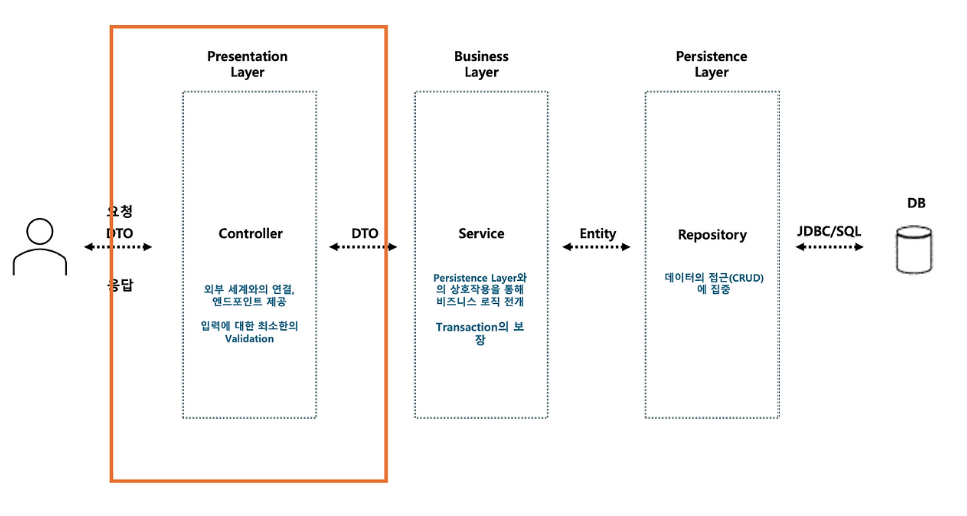

#  Layered Architecture (계층형 아키텍처)

---

#  개념


layered architecture란 애플리케이션을 여러 계층으로 나누어 설계하는 구조이다.


각 계층은 역할(책임)을 나눠서 개발하며, 유지보수와 확장성을 높이기 위한 구조이다.


---

#  핵심 구조

```
Controller → Service → Repository → Database
```


상위 계층은 하위 계층을 호출할 수 있지만,  
하위 계층은 상위 계층을 알지 못한다. (단방향 의존)


---

#  왜 사용하는가?


- 역할이 나뉘어서 코드가 깔끔해짐
- 유지보수 쉬움
- 기능 추가가 쉬움
- 협업하기 좋음

---

# ️ 단점

[확실]

- 계층이 많아질수록 코드 흐름이 길어짐
- 단순 기능도 여러 단계를 거쳐야 함
- Service에 로직이 몰릴 수 있음 

---

#  계층 구조 설명



---

## 1️ Presentation Layer (Controller)

[확실]

- 사용자 요청을 받는 곳
- 결과를 사용자에게 반환
"

### 역할
- 요청 받기 (HTTP 요청)
- Service 호출
- 결과를 JSON/XML 형태로 반환

---

## 2️ Business Layer (Service)


- 핵심 비즈니스 로직 처리
- 여러 Repository를 조합해서 하나의 기능 완성


### 역할
- 로직 처리
- 트랜잭션 관리
- 여러 데이터 조합

---

## 3️ Persistence Layer (Repository)

[확실]

- DB와 직접 통신하는 계층

### 역할
- CRUD (저장, 조회, 수정, 삭제)
- DB 접근

️ 주의

Repository에는 비즈니스 로직을 넣으면 안 된다

---

## 4️ Database / Entity


- Database: 실제 데이터 저장소 (MySQL 등)
- Entity: DB 테이블을 Java 객체로 표현한 것


---

## 5 DTO


DTO(Data Transfer Object)는 계층 간 데이터를 전달하는 객체이다.


### 왜 필요한가?


- Entity를 그대로 노출하면 위험
- API 응답 구조와 DB 구조 분리 가능

### 흐름

```
Controller ↔ DTO ↔ Service ↔ Entity ↔ Repository
```

---

#  계층 간 규칙 (중요)


✔ Controller → Service (O)  
✔ Service → Repository (O)  
❌ Controller → Repository (X)

 이유  
구조 깨짐 + 유지보수 어려움

---

#  전체 흐름 예시

 회원 조회 요청

```
1. Controller가 요청 받음
2. Service 호출
3. Service가 Repository 호출
4. Repository가 DB 조회
5. 결과 반환
```

👉 한줄 요약  
"Controller → Service → Repository → DB → 다시 반환"

---

#  핵심 정리


- 계층별로 역할을 나눈 구조
- 위 → 아래 방향으로만 호출
- 유지보수와 확장성에 좋음

---

#  실무 기준 추천 구조


- Controller → Service → Repository 구조 유지
- Entity는 외부에 직접 노출 ❌
- DTO 사용 필수
- Repository는 DB 접근만 담당
- Service는 비즈니스 로직 담당

---

#  한줄 정리

[확실]

layered architecture는 "역할을 나눠서 깔끔하게 개발하는 구조"
