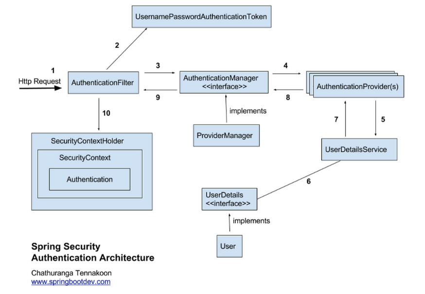
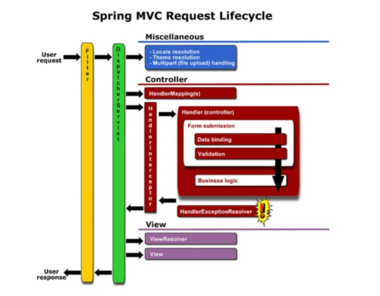

# Spring Security 정리

---

## 1. Spring Security란

-  Spring 기반 애플리케이션에서 **인증(Authentication)** 과 **인가(Authorization)** 를 담당하는 보안 프레임워크
-  요청을 **Filter 체인 기반**으로 처리하여 보안을 적용
-  로그인, 로그아웃, 세션관리, 권한관리 등 전반적인 보안 기능 제공

---

## 2. 인증(Authentication) vs 인가(Authorization)

### 인증 (Authentication)

-  사용자의 신원을 확인하는 과정
- 예: 로그인

### 인가 (Authorization)

-  인증된 사용자의 **권한 확인**
- 예: 관리자만 접근 가능

---

### 관계
인증 → 인가
(신원 확인) → (권한 확인)


---


### Principal / Credential

-  Principal: 사용자 식별 정보 (ID)
-  Credential: 인증 정보 (비밀번호)

---

## 3. Spring Security 인증 흐름



-  전체 흐름은 다음과 같음

1. 사용자 로그인 요청
2. AuthenticationFilter가 요청 가로챔
3. UsernamePasswordAuthenticationToken 생성
4. AuthenticationManager 전달
5. AuthenticationProvider 호출
6. UserDetailsService → DB 조회
7. UserDetails 생성
8. 인증 검증 수행
9. Authentication 객체 반환
10. SecurityContext 저장

---


## 4. Spring Security 주요 구성(모듈) 요소

```java
[Client]
↓
[HTTP Request]
↓
[Security Filter Chain]
↓
[AuthenticationFilter]
↓
[AuthenticationManager]
↓
[AuthenticationProvider]
↓
[UserDetailsService]
↓
[DB]
↑
[UserDetails]
↑
[AuthenticationProvider]
↑
[Authentication (인증 완료)]
↓
[SecurityContext]
↓
[SecurityContextHolder]
↓
[Controller]
```

### Authentication
-  현재 사용자(Principal)의 **인증 정보와 권한**을 담는 핵심 인터페이스
-  인증 전/후 상태를 모두 표현 가능
-  SecurityContext에 저장되어 전역에서 사용됨

```java
public interface Authentication extends Principal, Serializable {
    // 현재 사용자의 권한 목록을 가져옴
    Collection<? extends GrantedAuthority> getAuthorities();

    // credentials(주로 비밀번호)을 가져옴
    Object getCredentials();

    Object getDetails();

    // Principal 객체를 가져옴.
    Object getPrincipal();

    // 인증 여부를 가져옴
    boolean isAuthenticated();

    // 인증 여부를 설정함
    void setAuthenticated(boolean isAuthenticated) throws IllegalArgumentException;
}

```

---

### UsernamePasswordAuthenticationToken

-  Authentication 구현체
-  ID(Principal) + Password(Credential) 기반 인증 처리
-  인증 전: 권한 없음 / 인증 후: 권한 포함

```java
public class UsernamePasswordAuthenticationToken extends AbstractAuthenticationToken {
    // 주로 사용자의 ID에 해당함
    private final Object principal;
    // 주로 사용자의 PW에 해당함
    private Object credentials;

    // 인증 완료 전의 객체 생성
    public UsernamePasswordAuthenticationToken(Object principal, Object credentials) {
        super(null);
        this.principal = principal;
        this.credentials = credentials;
        setAuthenticated(false);
    }

    // 인증 완료 후의 객체 생성
    public UsernamePasswordAuthenticationToken(Object principal, Object credentials,
                                               Collection<? extends GrantedAuthority> authorities) {
        super(authorities);
        this.principal = principal;
        this.credentials = credentials;
        super.setAuthenticated(true); // must use super, as we override
    }
}


public abstract class AbstractAuthenticationToken implements Authentication, CredentialsContainer {
}
```

---

### AuthenticationManager

-  실제 인증 처리의 **진입점 (Entry Point)**
-  전달받은 Authentication 객체를 검증
-  내부적으로 AuthenticationProvider에 위임

```java
public interface AuthenticationManager {
    Authentication authenticate(Authentication authentication)
            throws AuthenticationException;
}
```

---

### AuthenticationProvider

-  실제 인증 로직을 수행하는 핵심 컴포넌트
-  사용자 정보(DB)와 비교하여 인증 수행
-  인증 성공 시 Authentication 객체 반환

```java
public interface AuthenticationProvider {

    // 인증 전의 Authenticaion 객체를 받아서 인증된 Authentication 객체를 반환
    Authentication authenticate(Authentication var1) throws AuthenticationException;

    boolean supports(Class<?> var1);

}
```

---

### ProviderManager

-  AuthenticationManager의 구현체
-  여러 AuthenticationProvider를 관리
-  Provider들을 순회하며 인증 시도

```java
public class ProviderManager implements AuthenticationManager, MessageSourceAware,
        InitializingBean {
    public List<AuthenticationProvider> getProviders() {
        return providers;
    }
    public Authentication authenticate(Authentication authentication)
            throws AuthenticationException {
        Class<? extends Authentication> toTest = authentication.getClass();
        AuthenticationException lastException = null;
        Authentication result = null;
        boolean debug = logger.isDebugEnabled();
        //for문으로 모든 provider를 순회하여 처리하고 result가 나올 때까지 반복한다.
        for (AuthenticationProvider provider : getProviders()) {
            ....
            try {
                result = provider.authenticate(authentication);

                if (result != null) {
                    copyDetails(authentication, result);
                    break;
                }
            }
            catch (AccountStatusException e) {
                prepareException(e, authentication);
                // SEC-546: Avoid polling additional providers if auth failure is due to
                // invalid account status
                throw e;
            }
            ....
        }
        throw lastException;
    }
}
```
---

### UserDetailsService


- 사용자 정보를 조회하는 인터페이스
-  보통 DB에서 사용자 정보를 조회하는 역할
-  loadUserByUsername() 메서드 제공


```java
public interface UserDetailsService {

    UserDetails loadUserByUsername(String var1) throws UsernameNotFoundException;

}
```

---

### UserDetails

- 사용자 정보를 담는 객체
-  username, password, 권한, 계정 상태 포함
-  Authentication 생성 시 사용됨

```java
public interface UserDetails extends Serializable {

    Collection<? extends GrantedAuthority> getAuthorities();

    String getPassword();

    String getUsername();

    boolean isAccountNonExpired();

    boolean isAccountNonLocked();

    boolean isCredentialsNonExpired();

    boolean isEnabled();

}
``` 

---

### SecurityContextHolder

-  현재 사용자 인증 정보를 저장하는 저장소
-  ThreadLocal 기반으로 동작 (요청 단위)
-  기본 전략은 MODE_THREADLOCAL (Spring 기본 설정)

```java
Authentication authentication =
        SecurityContextHolder.getContext().getAuthentication();

System.out.println(authentication.getName());
```
---

### SecurityContext

- Authentication 객체를 저장하는 컨테이너
-  SecurityContextHolder를 통해 접근

### 설정 예시

```java
SecurityContext context = SecurityContextHolder.createEmptyContext();
context.setAuthentication(authentication);

SecurityContextHolder.setContext(context);
```
---

### GrantedAuthority

-  사용자 권한을 표현하는 인터페이스
-  ROLE_USER, ROLE_ADMIN 형태로 사용
-  인가(Authorization) 과정에서 사용

```java
List<GrantedAuthority> authorities =
        List.of(new SimpleGrantedAuthority("ROLE_ADMIN"));
```

---

## 5. Filter vs Interceptor

### Filter

-  Servlet 스펙 기반 (`javax.servlet.Filter`)
-  **DispatcherServlet 이전**에 실행 가장 먼저 URL을 받는다
- 서블릿 컨테이너 레벨에서 요청/응답을 가장 먼저 가로챔
- 웹 애플리케이션 전반에서 HTTP 요청/응답을 처리하는 가장 초기 단계에 개입한다.

필터는 서블릿 컨테이너에서 실행되므로, Spring 컨텍스트와 독립적으로 작동 가능하며 Spring을 사용하지 않는 애플리케이션에서도 활용 가능하다.

#### 특징
- 전처리 / 후처리 수행
- 인증, 로깅, 인코딩 처리
- Spring과 독립적으로 동작 가능

#### 한계
- Spring DI, AOP 사용 어려움

Spring Boot에서는 @Component 또는 Java Config를 사용해 등록


```java
@Component
public class MyFilter implements Filter {

    @Override
    public void doFilter(ServletRequest request, ServletResponse response, FilterChain chain)
            throws IOException, ServletException {

        System.out.println("Filter: Before request processing");

        chain.doFilter(request, response);

        System.out.println("Filter: After response processing");
    }
}
``` 
-  `chain.doFilter()` 호출 전/후로 전처리/후처리 가능
---

### Interceptor

- Spring에서 HTTP Request와 HTTP Response를 Controller 앞과 뒤에서 가로 채는 역할을 한다.
- Servlet의 앞과 뒤에서 HTTP Request와 HTTP Response를 가로채는 필터와 유사하다.
- Interceptor를 구현하기 위해서는 HandlerInterceptor 인터페이스를 구현하여야 한다.


#### 특징
- 인증/인가 처리
- 로깅 및 감사
- 요청 데이터 검증
- 공통 응답 처리

### Interceptor 예시 코드

```java
@Component
public class MyInterceptor implements HandlerInterceptor {

    // Controller 실행 전에 수행
    @Override
    public boolean preHandle(HttpServletRequest request, HttpServletResponse response, Object handler)
            throws Exception {

        System.out.println("Interceptor: Before Controller");
        return true; // false면 요청 차단
    }

    // Controller 실행 후, View 렌더링 전에 수행
    @Override
    public void postHandle(HttpServletRequest request, HttpServletResponse response,
                           Object handler, ModelAndView modelAndView) throws Exception {

        System.out.println("Interceptor: After Controller");
    }

    // View까지 처리 완료 후 수행
    @Override
    public void afterCompletion(HttpServletRequest request, HttpServletResponse response,
                               Object handler, Exception ex) throws Exception {

        System.out.println("Interceptor: After Completion");
    }
}
```

### Interceptor 등록 코드

```java
@Configuration
public class WebConfig implements WebMvcConfigurer {

    private final MyInterceptor myInterceptor;

    public WebConfig(MyInterceptor myInterceptor) {
        this.myInterceptor = myInterceptor;
    }

    @Override
    public void addInterceptors(InterceptorRegistry registry) {
        registry.addInterceptor(myInterceptor)
                .addPathPatterns("/**"); // 적용 경로
    }
}
```

---



### Filter vs Interceptor 핵심 차이

| 구분 | Filter | Interceptor |
|------|--------|------------|
| 실행 위치 | DispatcherServlet 이전 | DispatcherServlet 이후 |
| 소속 | Servlet 컨테이너 | Spring MVC |
| DI 지원 | 어려움 | 가능 |
| 주요 용도 | 전역 처리 | 비즈니스 로직 전/후 처리 |


---

## 6. 핵심 정리

-  Spring Security는 Filter 기반 보안 처리
-  인증 → 인가 순서로 동작
-  SecurityContext에 사용자 정보 저장
-  Filter는 전역, Interceptor는 Spring 내부 처리

---

## 7. 참고 자료

-  https://dev-coco.tistory.com/174  
  → Spring Security 전체 흐름 및 구조 설명
