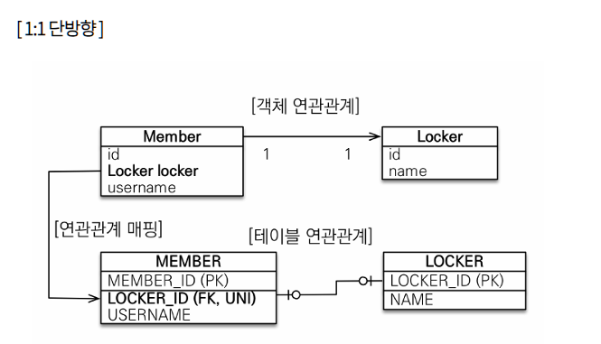
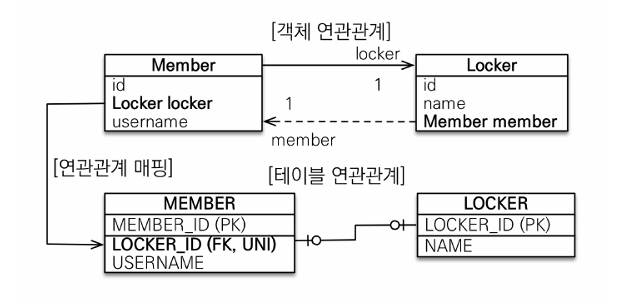
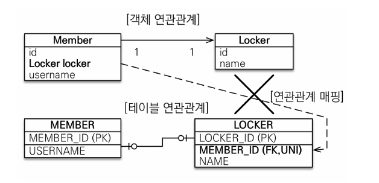
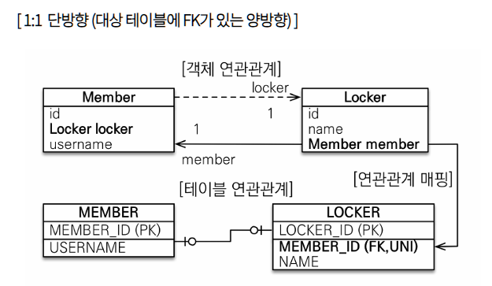
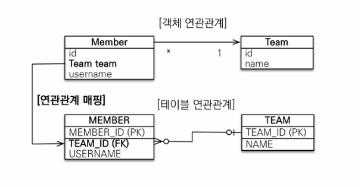
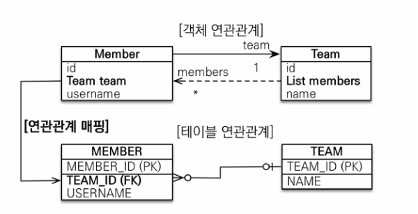
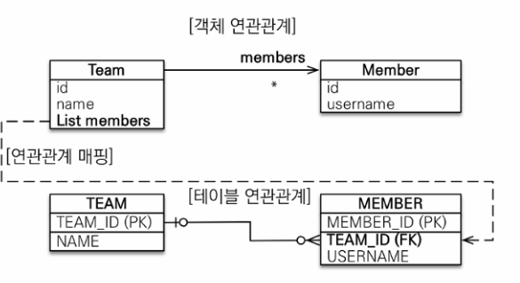
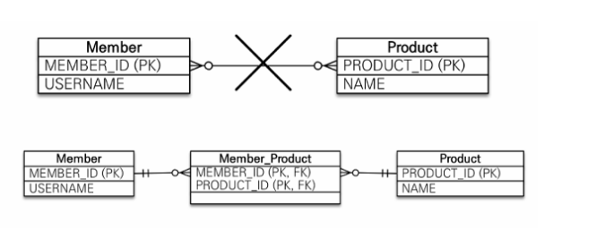
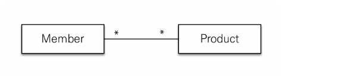
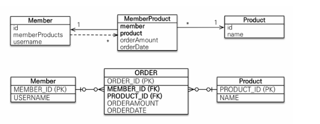

# 연관관계 매핑


객체의 참조(메모리 주소)와 데이터베이스 테이블의 외래 키(FK)를 연결하는 기술이다.  
JPA에서 연관 관계에 있는 상대 테이블의 PK를 멤버 변수로 직접 갖는 것이 아니라, 엔티티 객체 자체를 참조한다.  
엔티티 간 다중성을 정의하고 객체 그래프 탐색을 가능하게 하여  
데이터베이스 중심이 아닌 객체 지향적인 설계를 도와준다.

---

# 방향

## 단방향

두 엔티티가 관계를 맺을 때, 한쪽의 엔티티만 참조하는 것을 의미한다.

## 양방향

두 엔티티가 관계를 맺을 때, 양쪽이 서로 참조하는 것을 의미한다.

---

# 단방향, 양방향


테이블은 외래 키(FK) 하나로 조인을 통해 양쪽 방향 조회가 가능하므로 방향이라는 개념이 없다.  

객체는 참조 필드를 가진 객체만 연관된 객체를 조회할 수 있다.


객체 관계에서 한쪽만 참조하면 단방향, 양쪽에서 서로 참조하면 양방향이다.

---

# 방향 예시


회원 -> 팀 또는 팀 -> 회원 둘 중 한쪽만 참조하면 단방향, 양쪽을 참조하면 양방향이다.

데이터 모델링에서는 FK로 인해 양방향 조회가 가능하지만,  
객체지향 모델링에서는 필요에 따라 단방향/양방향을 선택해야 한다.
---

# 연관관계의 주인 (Owner)


- JPA는 두 객체 연관관계 중 하나를 정해서 데이터베이스 외래 키(FK)를 관리하는데 이것을 연관관계의 주인이라 한다.
- 외래 키를 가진 테이블과 매핑한 엔티티(일반적으로 N쪽에 해당하는)가 외래 키(FK)를 관리하는 게 효율적이므로 보통
이곳을 연관관계의 주인으로 선택한다.
- 주인이 아닌 방향은 외래 키를 변경할 수 없고 읽기만 가능하다.

  -   주인이 아닌 엔티티는 mappedBy 옵션에 반대쪽 매핑의 필드 이름을 넣는다.

---

# 다중성

## @JoinColumn
외래 키를 매핑할 때 사용한다.

---

## @OneToOne


두 엔티티 간 1:1 관계를 정의하는 어노테이션이다.  
한 테이블의 한 로우가 다른 테이블의 한 로우에만 매핑될 때 사용한다.

예시)
회원과 사물함처럼 한 테이블의 한 로우가 다른 테이블의 한 로우에만 매핑될 때 사용한다.

연관관계의 주인 테이블에 @JoinColumn으로 외래키(FK)를 설정하여 관계를 관리한다.

양쪽이 서로 하나의 관계만 가지며 반대도 일대일 관계이다.

---

# 1:1 단방향



```java
@Entity
public class Member {
@Id
private Long id;

@Column(name = "name")
private String username;

private Integer age;

@OneToOne
@JoinColumn(name = "LOCKER_ID")
private Locker locker;

}
```

일대일 관계는 주 테이블 또는 대상 테이블 중 FK 선택이 가능하다.  
FK에는 UNIQUE 제약 조건이 필요하다.


N:1연관관계와 동일하게 FK가 있는 곳이 연관관계의 주인이며, 주인 아닌 곳에 mapperBy를 넣어준다.

--- 

# 1:1 양방향



```java
@Entity
public class Member {

@Id
private Long id;

@Column(name = "name")
private String username;

private Integer age;

@OneToOne
@JoinColumn(name = "LOCKER_ID")
private Locker locker;

}

@Entity
public class Locker {

@Id
private Long id;

@Column
private String name;

@OneToOne(mappedBy = "locker")
private Member member;

}
```

N:1 양방향 매핑과 동일하게 FK가 있는 곳이 연관관계의 주인이다.

주인이 아닌 곳은 mappedBy를 사용한다.

---

# 1:1 단방향 (대상 테이블에 FK가 있는 단방향)



1:1 대상 테이블 FK 단방향 관계는 JPA를 지원을 안한다. 즉, 불가능한 모델이다.

대신 대상 테이블에 FK가 있도록 하고 싶다면, 다음과 같이 양방향으로 만들어야 한다.

# 1:1 단방향(대상 테이블에 FK가 있는 양방향)



이방법은 맨 처음 1:1 방식을 대칭으로 뒤집은 것을 뿐이다.

---

# 1:1 매핑 정리

## 주 테이블에 FK


- 주 객체가 대상 객체를 참조를 가지는 것처럼 주 테이블에 FK를 두고 대상 테이블을 찾는다
- JPA 매핑이 편리함
- 객체지향 개발 선호

장점: 주 테이블만 조회해도 대상 테이블에 데이터가 있는 확인 가능
단점: FK nullable 허용 가능성 존재

---

## 대상 테이블에 FK

- 대상 테이블에 FK 존재
- 전통적인 DB 설계에서 선호되는 경우가 있다 (상황에 따라 다름)

장점: 1:1 → 1:N 구조 변경 시 테이블 변경이 적음 -> 구조를 유지한다.
unique 제약 조건만 없애도록 UPDATE를 해주면 끝난다.

단점: 프록시 한계로 인해 지연로딩 설정이 어려운 경우가 존재한다

---

## @ManyToOne




여러 엔티티가 하나의 엔티티를 참조하는 다대일 관계


외래 키를 가진 엔티티(N쪽)가 주인이 된다


실무에서 가장 많이 사용되는 매핑이다

가장 많이 사용하는 연관관계이며, 다대일의 반대는 일대다이다. 


```java
@Entity
public class Member {

    @Id
    private Long id;

    @Column(name="name")
    private String name;

    private Integer age;

    @ManyToOne
    @JoinColumn(name = "TEAM_ID")
    private Team team;
}
```
```
@Entity
public class Team {

    @Id
    private Long id;

    @Column(name="name")
    private String name;
}
```
Team객체와 @ManyToOne 의 관계를 맺고 있는 것을 확인할 수 있는데, 코드를 보면 일(Team) 대 다(Member)관계이며, 다쪽인 Member에 @JoinColumn(FK)가 설정되어 있다.

단방향이기 때문에 Member에서 Team 쪽의 참조만 가지고 있고 Team쪽에서는 다른 참조 관계를 갖고 있지 않다.

---

# 다대일 주요 속성 - @ManyToOne

# @ManyToOne 주요 속성

| 속성 | 설명 | 기본값 |
|------|------|------|
| optional |  false로 설정하면 연관된 엔티티가 반드시 존재해야 한다 (NOT NULL 의미) | true |
| fetch |  연관 엔티티 조회 전략 설정 |  @ManyToOne=FetchType.EAGER @OneToMany=FetchType.LAZY
|
| cascade |  연관 엔티티에 영속성 전이를 적용 |  기본값 없음 |
| targetEntity |  연관된 엔티티의 타입 정보를 설정한다. 이 기능은 거의 사용하지 않는다. 컬렉션을 사용해도 제네릭으로 타입정보를 알 수 있다 |  필드 타입으로 자동 추론 |


---
# N:1 양방향



외래 키(FK)가 있는 쪽이 연관관계의 주인이다. 양쪽에서 서로 참조하도록 개발하면 된다.
연관관계가 주인이 아닌 쪽은 단순 조회만 가능하기에 필드만 추가해 주면 된다.


```
@Entity
public class Member {

    @Id
    private Long id;

    @Column(name="name")
    private String name;

    private Integer age;

    @ManyToOne
    @JoinColumn(name = "TEAM_ID")
    private Team team;
}
```

```java
@Entity
public class Team {

    @Id
    private Long id;

    @Column(name="name")
    private String name;

    @OneToMany(mappedBy = "team")
    private List<Member> members = new ArrayList<>();
}
```
기존에 아무 참조관계도 없던 Team 클래스에 @OneToMany(1:N)관게가 설정되었다.

양방향 관계에서 연관관계 주인이 아닌곳에서 mappedBy 속성을 통해 반대편의 연관관계 주인을 나태내줘야 한다.

---

## @OneToMany
일대다는 1이 연관관계의 주인이 되는 방식으로 권장하지 않는다.
실무에서도 거의 사용하지 않는다.



테이블 1:N 관계는 항상 다 쪽에 외래 키가 있다.
물론 FK가 N쪽에 있는 것은 생각 해보면 당연하다.

Team의 Members를 수정해 보면 TEAM_ID라는 다른 테이블에 있는 FK를 UPDATE 해줘야 한다.

일대다 단방향은 1:N에서 1의 입장에서 연관관계를 관리하겠다는 의미이기 때문에 어찌 되든 다른 테이블에 있느 FK를 관리해야한다.

객체와 테이블의 차이 때문에 반대편의 외래키를 관리하는 특이한 구조를 나타낸다.


```java
@Entity
public class Team {

    @Id
    private Long id;

    @Column(name="name")
    private String name;

    @OneToMany
    @JoinColumn(name = "TEAM_ID")
    private List<Member> members = new ArrayList<>();
}
```

Team 엔티티를 보면 Team의 members 필드에 joinColumn(name = "TEAM_ID")로 지장되어 있다.

Team이 FK를 관리하게 되는 것이다.


이유: FK가 다른 테이블에 있기 때문

```
Member member = new Member();
member.setName("member1");
entityManager.persist (member);

Team team = new Team();
team.setName("teamA");
team.getMembers().add(member); // 문제 발생하는 곳

entityManager.persist(team);

tr.commit();
```
---
# 실행 결과 (SQL 흐름)

INSERT 먼저 발생

INSERT INTO MEMBER (name, TEAM_ID) VALUES ('member1', NULL);

INSERT INTO TEAM (name) VALUES ('teamA');

 이후 UPDATE 발생

UPDATE MEMBER
SET TEAM_ID = (team의 PK)
WHERE MEMBER_ID = (member의 PK);

이는 1:N에서 save될 때, 양 쪽 객체를 저장한 뒤 UPDATE쿼리를 통해 FK 설정하기 때문이다.

---

# 왜 이런 쿼리가 발생하는가


@OneToMany 단방향 + @JoinColumn 구조에서는  
FK(TEAM_ID)는 MEMBER 테이블에 존재하지만


연관관계의 주인은 TEAM이다

따라서 JPA는 다음 순서로 처리한다

1. MEMBER 먼저 INSERT (이 시점에는 TEAM_ID 없음 → NULL)
2. TEAM INSERT
3. TEAM이 MEMBER의 FK를 수정 → UPDATE 발생

---

# 문제 핵심


다른 테이블의 FK를 관리"하기 때문에 UPDATE 쿼리가 추가 발생한다


객체는 Team을 수정했지만  
DB에서는 Member 테이블 UPDATE 발생

---

# 정리


- INSERT 2번 + UPDATE 1번 발생
- 성능 비효율 발생
- 직관적이지 않은 쿼리 흐름

1. JoinColumn을 꼭 사용해야 한다. 만약 그렇지 않으면 중간에 JOIN 테이블이 따로 생성된다.
2. DB테이블에서는 항상 N쪽에 FK가 있기 때문에 패러다임 충돌이 있다.
   그러면 Entity가 관리하는 FK가 다른 테이블에 있게 되고, 위 로그처럼 UPDATE쿼리가 발생한다.
3. 실무에서는 테이블이 1~2개가 아닌 수십가지가 공존한다. 그렇기에 관리가 어려움


→ 그래서 실무에서는

@OneToMany 단방향 ❌ 보다는 @ManyToOne 양방향 매핑을 사용하자

---

## @ManyToMany

관계형 DB는는 정규화된 테이블 2개로  N:M 직접 표현 불가 → 중간 테이블 필요
따라서 연결테이블을 추가해서 1:N, N:1 관계로 풀어내야 한다.




하지만 객체 객체는 컬렉션으로 N:M 표현 가능

객체는 Member에 Products라는 참조 변수를, Products에 Member라는 참조변수를 만들면 N:M관계가 가능하다.



N:M관계가 가능한 객체와 N:M관계가 불가능한 테이블을 매핑하기 위해 @ManyToMany애노테이션과 @JoinTable로 연결 테이블을 지정해야한다.

```java
@Entity
public class Member {

    @Id
    @Column(name = "Member_Id")
    private Long id;

    private String name;

    @ManyToMany
    @JoinTable(
        name = "MEMBER_PRODUCT",
        joinColumns = @JoinColumn(name="MEMBER_ID"),
        inverseJoinColumns = @JoinColumn(name="PRODUCT_ID")
    )
    private List<Product> products = new ArrayList<>();
}
```

Member 엔티티와 Product엔티티를 @ManyToMany, N:M 연관관계를 설정했다.

N:M 관계를 풀기 위해서는 중가에 매핑 테이블이 필요하기 때문에 @JoinTable 설정을 통해 별도로 엔티티를 만들지 않고 풀 수 있다.

```
@JoinTalbe
name: 연결 테이블 지정
joinColumns: 현재 방향에서 매핑한 Join 컬럼 정보 지정
inverseJoinColumns: 반대 방향에서 매핑한 Join컬럼 정보 지정
```
따라서 Member엔티티 Product연관관계를 추가 후 persist를 호출하면 아래와 같은 쿼리가 발생한다.
```

INSERT INTO PRODUCT

INSERT INTO MEMBER

INSERT INTO  MEMBER\_PRODUCT

```


---

# N:M 한계

- 편리해 보이지만 실물에서는 사용 안 한다.
- 연결 테이블(Join 테이블)이 단순히 연결만 하고 끝나지 않는다.
- 중간 테이블에 추가적인 데이터를 넣을 수 없다는 한계점이 존재한다.
-   주문 시간, 수량 같은 데이터를 들어올 수 있는데, 이를 반영하기 어렵다.
- 중간 테이블이 숨겨져 있기 때문에 의도치 않은 쿼리가 생성될 수 있다.


실무에서는 거의 사용하지 않는다

---

# N:M 해결

- 연결 테이블용 엔티티를 따로 추가(연결 테이블을 엔티티로 승격)한다.

- 이전에는 @JoinTable을 사용하여 연결 테이블이 생성되었지만, 이번에는 연결 테이블을 Entity로 만들어 사용한다.

- @ManyToMany → @OneToMany + @ManyToOne



```java
// 연결 테이블 Entity

@Entity
public class MemberProduct {

@Id
@GeneratedValue
private Long id;

@ManyToOne
@JoinColumn(name = "MEMBER_ID")
private Member member;

@ManyToOne
@JoinColumn(name="PRODUCT_ID")
private Product product;

private int count;
private int price;
private LocalDateTime orderDateTime;

}
// Member

@Entity
public class Member {

@Id
private Long id;

@Column(name = "name")
private String name;

private Integer age;

@OneToMany(mappedBy = "member")
private List<MemberProduct> memberProducts = new ArrayList<>();

}
//Product

@Entity
public class Product {

@Id
private Long id;

@Column(name = "name")
private String name;

@OneToMany(mappedBy = "product")
private List<MemberProduct> memberProducts = new ArrayList<>();

}
```
---
# 정리


연관관계 매핑은 객체와 테이블 간의 패러다임 차이를 해결하기 위한 핵심 기술이다

다중성은 어떤 엔티티 기준으로 관계를 바라보느냐에 따라 달라진다

실무 기준 추천

N:1 단방향 → 기본
N:1 양방향 → 필요 시
1:N 단방향 → 지양
N:M → 중간 엔티티 사용