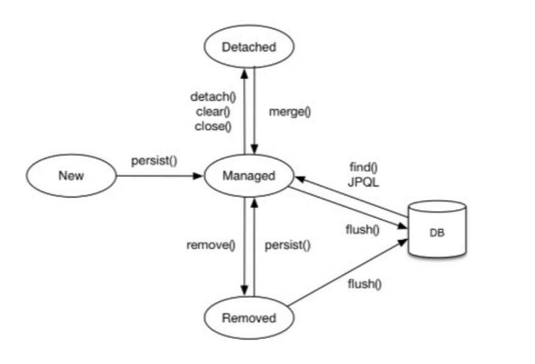
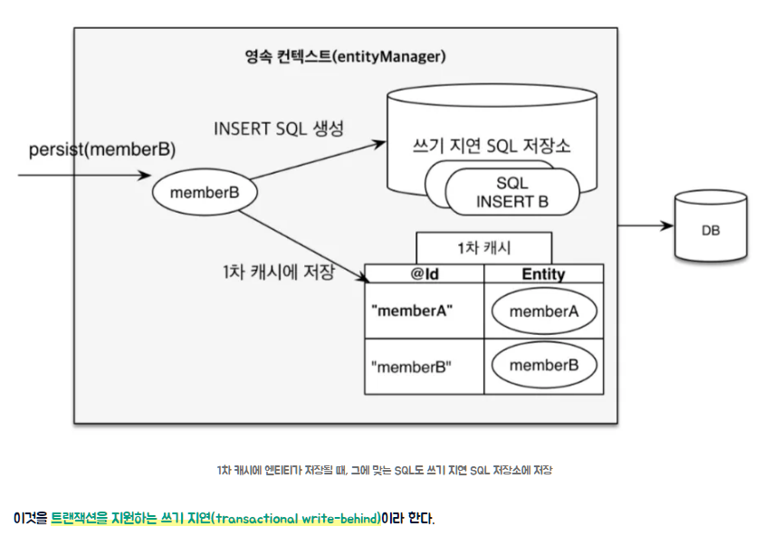
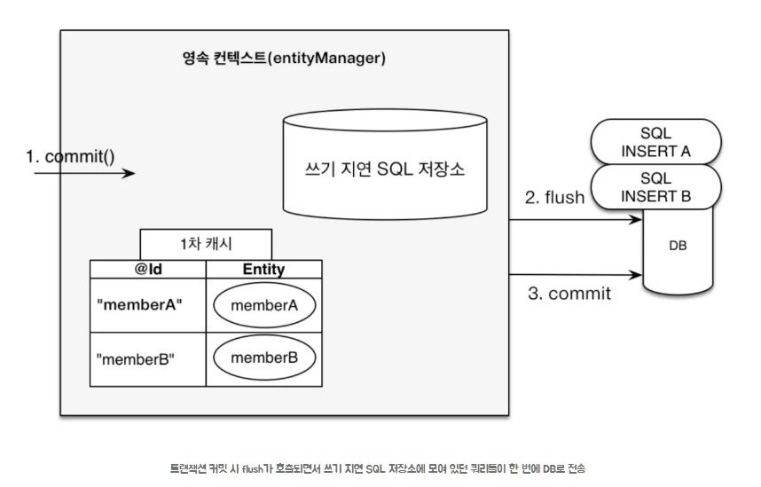

# 영속성 컨텍스트 (Persistence Context)

## 개요


JPA에서 Entity를 영구 저장하는 가상의 환경이다.
→ **엔티티를 "영구 저장"하는 곳이 아니라, DB에 저장하기 전에 잠시 관리하는 공간이다.**


영속성 컨텍스트는
애플리케이션과 데이터베이스 사이에서 객체(Entity)를 관리하는 공간이다.

쉽게 말하면
 **"DB에 바로 저장하지 않고, 잠깐 보관하면서 관리하는 공간"**

---

## 쉽게 이해하기

* DB = 창고
* 영속성 컨텍스트 = 책상
 
* 책상에서 작업하다가 → 마지막에 창고(DB)에 넣음

---

## EntityManager

엔티티 매니저(EntityManager)는 영속성 컨텍스트에 접근하는 객체이다.


 엔티티 매니저를 통해서만 데이터를 저장/조회할 수 있다.

---

## 스프링에서의 특징

여러 개의 엔티티 매니저가 하나의 영속성 컨텍스트 사용
→ **하나의 트랜잭션 안에서 동일한 영속성 컨텍스트를 공유한다.**

---

## 기본 사용

```id="pc1"
em.persist(entity); // 저장 (영속 상태)
em.find(Entity.class, id); // 조회 (영속 상태)
```


이렇게 관리되는 상태를 "영속 상태"라고 한다.

---

## 엔티티 생명주기



# EntityManager 주요 메서드 정리

## detach()


특정 엔티티 하나를 영속성 컨텍스트에서 제거한다.

 쉽게 말하면
"이 객체 이제 관리하지 마!"

```id="em1"
em.detach(entity);
```

 특징

* 변경 감지 안됨
* 값 바꿔도 DB 반영 안됨

---

## clear()

영속성 컨텍스트를 **전체 초기화**한다.

쉽게 말하면
"관리 중인 객체 전부 삭제!"

```id="em2"
em.clear();
```

 특징

* 모든 엔티티가 준영속 상태로 변경됨
* 1차 캐시 초기화됨

---

## close()


영속성 컨텍스트를 종료한다.

```id="em3"
em.close();
```
 특징

* 더 이상 EntityManager 사용 불가
* 내부 영속성 컨텍스트도 함께 종료됨

쉽게 말하면
"이제 이 매니저 못 씀"

---

## remove()


엔티티를 삭제 상태로 만든다.

```id="em4"
em.remove(entity);
```

특징

* 바로 DB 삭제 아님
* commit 시 삭제됨

상태 변화
영속 → 삭제(removed)

---

## find()

[확실]
ID로 엔티티 조회

```id="em5"
Member member = em.find(Member.class, id);
```

동작 순서

1. 1차 캐시 확인
2. 없으면 DB 조회

특징

* 조회된 객체는 영속 상태
* 동일성 보장됨

---

## flush()


영속성 컨텍스트의 변경 내용을 DB에 반영

```id="em6"
em.flush();
```

특징

* commit 전에 실행됨
* SQL을 DB에 보냄
* 트랜잭션은 유지됨 (commit 아님)

---

## 핵심 차이 요약

[확실]

| 메서드    | 역할    | 쉽게 설명       |
| ------ | ----- | ----------- |
| detach | 개별 제거 | 하나만 관리 해제   |
| clear  | 전체 제거 | 전부 초기화      |
| close  | 종료    | 더 이상 사용 불가  |
| remove | 삭제 예약 | commit 시 삭제 |
| find   | 조회    | ID로 찾기      |
| flush  | DB 반영 | SQL 실행      |

---

## 한줄 정리


* detach → 하나 제거
* clear → 전체 초기화
* close → 완전 종료
* remove → 삭제 예약
* find → 조회
* flush → DB 반영
---


### 1. 비영속 (new)

영속성 컨텍스트와 전혀관계가 없는 새로운 상태 엔티티 객체


* 그냥 객체만 만든 상태
* DB와 관계 없음

---

### 2. 영속 (managed)

엔티티 매니저를 통해 엔티티들 영속성 컨텍스트에 저장하거나, DB로부터 조회했을 때 영속성 컨텍스트가 엔티티를 관리하게된다.<br>영속성 컨텍스트가 관리하는 엔티티를 영속상태라한다.
<br>이때 영속성 컨텍스트는 엔티티들 식별자 값으로 구분한다.<br>
만약 식별자 값이 없으면 예외가 발생한다.

* 영속성 컨텍스트가 관리하는 상태
* DB와 연결됨

---

### 3. 준영속 (detached)

영속성 컨텍스트가 관리하던 영속 상태의 엔티티를 영속성 컨텍스트가 관리하지 않게 됐을 때 준영속 상태가된다.

* 관리에서 벗어난 상태

쉽게 말하면 "관리하던 걸 놓아버린 상태"

---

### 4. 삭제 (removed)

엔티티를 영속성 컨텍스트와 데이터베이스에서 flush() 호출 시 삭제한다.

* 삭제 예정 상태
* commit 시 DB에서 삭제됨

---

## 1차 캐시


영속성 컨텍스트 내부에는 캐시가 있는데 이를 1차 캐시라고 한다. 영속 상태의 엔티티를 이곳에 저장한다.<br>
1차 캐시의 키는 식별자 값(데이터베이스의 기본키)이고 값은 엔티티 인스턴스이다.


* key = ID
* value = 객체

---

### 조회 흐름


1. 1차 캐시 확인
2. 있으면 → 메모리에 있는 1차 캐시에서 엔티티 조회
3. 없으면 → DB 조회
4. 조회한 데이터로 엔티티를 생성해 1차 캐시에 저장(엔티티를 영속 상태로 만든다.)
5. 조회한 엔티티 반환

---

## 동일성 보장

동일성(identity)은 실제 인스턴스(인스턴스 주소)과 같다는 의미로 참조 값을 비교하는 ==를 사용한다.<br>
동등성(equality)은 인스턴스가 가지고 있는 값이 같다는 의미로 equals() 메서드를 사용한다.<br>
영속성 컨텍스트에서 관리되는 엔티티들 비교할 때, @Id값이 같다면 1차 캐시에 있는 동일한 엔티티 인스턴스를 반환한다.


```id="pc2"
Member m1 = em.find(Member.class, "member1");
Member m2 = em.find(Member.class, "member1");
```

 결과

```id="pc3"
m1 == m2  // true
```

같은 객체를 반환 한다.<br>
만약 영속성 컨텍스트를 사용하지 않고 바로 DB를 거쳐 인스턴스를 생성 했다면, 매번 새로운 인스턴스가 <br>
생성되어 동일성 보장하지 않는다.

---

## 쓰기 지연





```id="pc4"
em.persist(memberA);
em.persist(memberB);
```

바로 DB에 저장 안됨

commit 시 실행

---

## 변경 감지 (Dirty Checking)

영속성 컨텍스트가 관리하는 엔티티의 조회 시점 상태(스냅샷)와 트랜잭션 종료 시점의 상태를 비교하여, 변경된 내용이 있으면 자동으로 UPDATE SQL을 생성해 DB에 반영하는 기능이다. 

영속 상태의 엔티티에만 적용되며, 별도 save() 호출 없이 객체 값만 변경하면 자동을 DB에 반영된다.


JPA는 엔티티 영속성을 컨텍스트에 보관할 때, 최초 상태를 복사해서 스냅샹으로 저장한다.

그러다 플러시(flush())가 호출되는시점에 스냅샷과 엔티티를 비교해서 변경된 엔티티를 찾는다

```id="pc5"
member.setName("변경");
```

 따로 save 없이 자동 UPDATE

---

## 플러시 (Flush)


영속성 컨텍스트 → DB 반영

즉, 영속성 컨텍스트를 데이터베이스와 동기화하는 작업이라고 생각하면 된다.

---

## 플러시 과정

1. 변경감지가 동작해서 영속성 컨텍스트 안에 있는 모든 엔티티를 스냅샷과 비교한다.
2. 수정된 엔티티가 있으면 수정 쿼리를 만들어 쓰기 지연 SQL 저장소 등록한다.
3. 이후 commit()이 호출되면, 쓰기 지연 SQL 저장소의 모든 쿼리가 데이터베이스에 전송된다.

---

### 플러시 실행 시점


Transaction commit
- 엔티티 매니저의 flush() 메서드를 직접 호출해서 영속성 컨텍스트를 강제로 플러시한다.

직접 flush() 자동 호출
- 트랜잭션이 커밋되기 전에 JPA는 영속성 컨텍스트의 변경 내용을 데이터베이스 반영하기 위해 플러시를 자동으로 호출한다.

JPQL 실행 시 자동 호출
- JPQL 쿼리 실행시 자동 호출: 데이터베이스에 JPQL 쿼리를 직접 작성해서 날릴 때도 플러시가 자동으로 실행된다.

플러시가 호출된후, UPDATE  쿼리 생성됨 이를 통해 단순히 영속성 컨텍스트가 관리하는 영속 상태 엔티티의 필드값을 
<br>바꾸는 것만으로 데이터베이스 UPDATE쿼리를 날리 수 있다.<br> select가 없는데 이는 1차 캐시에서 저장된 엔티티를 메모리에서 바로 조회했기 때문이다.

---

## 변경 감지 동작 과정


1. 트랙잭션을 커밋하면 엔티티 매니저 내부에서 먼저 플러시가 호출된다.
2. 엔티티와 스냅샷을 비교하여 변경된 엔티티를 찾는다.
3. 변경된 엔티티가 있으면 수정 쿼리를 생성해서 쓰기 지연 SQL 저장소에 저장한다.
4. 쓰기 지연 저장소의 SQL을 플러시한다.
5. 데이터베이스 트랜잭션을 커밋한다

>> 변경 감지는 영속성 컨텍스트가 관리하는 영속 상태의 엔티티만 적용된다.

---

## 핵심 정리


 영속성 컨텍스트는
"객체를 DB에 바로 저장하지 않고, 잠깐 관리하는 공간"

 가장 중요한 기능

* 1차 캐시 (메모리에 저장)
* 동일성 보장 (같은 객체 유지)
* 쓰기 지연 (SQL 모아서 실행)
* 변경 감지 (자동 업데이트)
* 지연 로딩 (필요할 때 조회)
---


## 한줄 정리


영속성 컨텍스트는
"객체를 저장하고, 변경을 자동으로 관리해주는 JPA의 핵심 기능"이다.

출처: https://bnzn2426.tistory.com/145

출처: https://velog.io/@neptunes032/JPA-%EC%98%81%EC%86%8D%EC%84%B1-%EC%BB%A8%ED%85%8D%EC%8A%A4%ED%8A%B8%EB%9E%80
